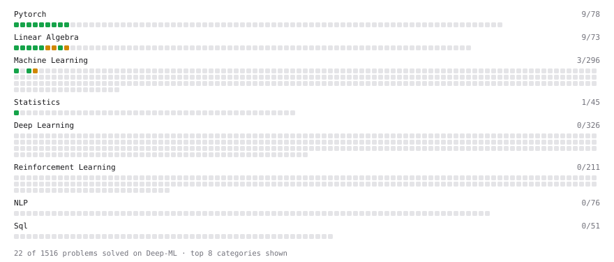

# Deep-ML

My machine learning practice from [Deep-ML](https://www.deep-ml.com). Every solution here was written by hand.

**20** solved · 20 problems · 0 labs · 0 math

[**Browse the interactive portfolio**](https://Janik-lab.github.io/deep-ml/) to replay this filling in over time.

## Problems

| | Difficulty | Solved | |
| --- | --- | --- | --- |
| [Add a Bias Vector to a Batch via Broadcasting](https://www.deep-ml.com/problems/882) | easy | 2026-10-02 | [solution](problems/0882-add-a-bias-vector-to-a-batch-via-broadcasting) |
| [Build a Linear Regression Model with nn.Module](https://www.deep-ml.com/problems/885) | easy | 2026-10-05 | [solution](problems/0885-build-a-linear-regression-model-with-nn-module) |
| [Calculate 2x2 Matrix Inverse](https://www.deep-ml.com/problems/8) | easy | 2026-09-30 | [solution](problems/0008-calculate-2x2-matrix-inverse) |
| [Calculate Covariance Matrix](https://www.deep-ml.com/problems/10) | easy | 2026-09-30 | [solution](problems/0010-calculate-covariance-matrix) |
| [Calculate Mean by Row or Column](https://www.deep-ml.com/problems/4) | easy | 2026-09-30 | [solution](problems/0004-calculate-mean-by-row-or-column) |
| [Compute a Gradient with PyTorch Autograd](https://www.deep-ml.com/problems/884) | easy | 2026-10-02 | [solution](problems/0884-compute-a-gradient-with-pytorch-autograd) |
| [Create a Float Tensor from a Python List](https://www.deep-ml.com/problems/880) | easy | 2026-10-01 | [solution](problems/0880-create-a-float-tensor-from-a-python-list) |
| [Feature Scaling Implementation](https://www.deep-ml.com/problems/16) | easy | 2026-10-01 | [solution](problems/0016-feature-scaling-implementation) |
| [Implement a Linear Layer Forward Pass with Matrix Multiplication](https://www.deep-ml.com/problems/883) | easy | 2026-10-02 | [solution](problems/0883-implement-a-linear-layer-forward-pass-with-matrix-multiplication) |
| [Linear Regression Using Normal Equation](https://www.deep-ml.com/problems/14) | easy | 2026-09-30 | [solution](problems/0014-linear-regression-using-normal-equation) |
| [Matrix-Vector Dot Product](https://www.deep-ml.com/problems/1) | easy | 2026-09-30 | [solution](problems/0001-matrix-vector-dot-product) |
| [Reshape and Transpose a Tensor](https://www.deep-ml.com/problems/881) | easy | 2026-10-01 | [solution](problems/0881-reshape-and-transpose-a-tensor) |
| [Reshape Matrix](https://www.deep-ml.com/problems/3) | easy | 2026-09-30 | [solution](problems/0003-reshape-matrix) |
| [Run One Training Step: Forward, Loss, Backward, Optimizer](https://www.deep-ml.com/problems/886) | easy | 2026-10-05 | [solution](problems/0886-run-one-training-step-forward-loss-backward-optimizer) |
| [Scalar Multiplication of a Matrix](https://www.deep-ml.com/problems/5) | easy | 2026-09-30 | [solution](problems/0005-scalar-multiplication-of-a-matrix) |
| [Transpose of a Matrix](https://www.deep-ml.com/problems/2) | easy | 2026-09-30 | [solution](problems/0002-transpose-of-a-matrix) |
| [Calculate Eigenvalues of a Matrix](https://www.deep-ml.com/problems/6) | medium | 2026-09-30 | [solution](problems/0006-calculate-eigenvalues-of-a-matrix) |
| [K-Means Clustering](https://www.deep-ml.com/problems/17) | medium | 2026-10-01 | [solution](problems/0017-k-means-clustering) |
| [Matrix times Matrix ](https://www.deep-ml.com/problems/9) | medium | 2026-09-30 | [solution](problems/0009-matrix-times-matrix) |
| [Matrix Transformation ](https://www.deep-ml.com/problems/7) | medium | 2026-09-30 | [solution](problems/0007-matrix-transformation) |

---

_This file is regenerated by Deep-ML on every push._
